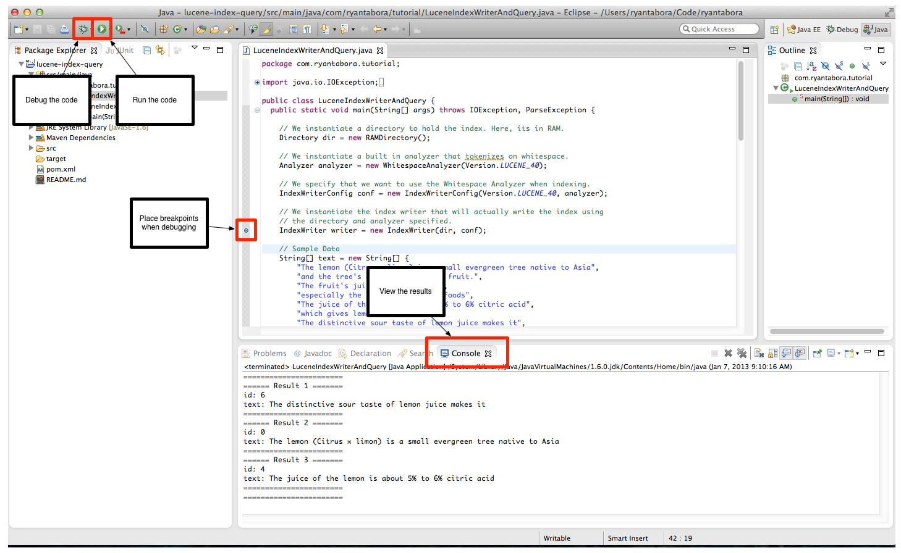

Real Time Search and Analytics on Big Data - Lucene Basics
=============

Introduction
-------
This demo will familiarize you with some of the basic Lucene functions, indexing and querying. Code is provided that indexes a string and then performs a query on it.

Prerequisites
-------
* The project should be imported in your IDE.

Tips
-------
* General Tip: The project home ($PROJECT\_HOME) is defined as the top level directory in the github project. The $PROJECT\_HOME contains the slide deck, the sample data, and all of the exercises/demos.
* General Tip: The module home is defined as the top level directory for a given exercise/demo. For example, $PROJECT_HOME/01-lucene-basics, is the $MODULE\_HOME for this module. 
* Maven Tip: Always run maven commands from the $MODULE\_HOME/ folder. Maven must be run in a directory that contains the pom.xml file which contains the project build instructions.
* Eclipse Tip: In order to import required packages, you can use the shortcut CMD + SHIFT + O. It makes organizing your imports much much easier.
* Eclipse Tip: In order to format tabs and spaces in your code, you can use the shortcut CMD + SHIFT + F. I use this very often to make my code more easily readable.

Overview
-------

### Package Layout

First navigate to the project in Eclipse so we can understand what is included in the project. We will examine each class at a high level before running or writing any code.

#### LuceneIndexWriterAndQuery

This is the only class in this project, and it contains the code to index and query data through Lucene.

Run the Exercise
-------

You have two options to run this exercise, either use Eclipse or build the jar and run via the java -jar command. 

### Use Eclipse

Once the project is open in Eclipse, you can run the project by clicking the green "play" button in the top left corner of the Eclipse GUI. This will run the class and display the results in the console. You can also click the bug icon in the top left corner of the Eclipse GUI to debug the code line by line.

### Build and run the jar

First, make sure you're in the $MODULE_HOME (you should see a pom.xml in the directory that you are in).

	cd ~/code/ryantabora/RealTimeSearchAndAnalytics/01-lucene-basics/

Then create the jar.

	mvn clean package

You will see some maven messages you can ignore (unless for some reason you get a BUILD FAILURE). But you should end up seeing this: 

	[INFO] ------------------------------------------------------------------------
	[INFO] BUILD SUCCESS
	[INFO] ------------------------------------------------------------------------
	[INFO] Total time: 5.734s
	[INFO] Finished at: Mon Jan 07 09:53:25 PST 2013
	[INFO] Final Memory: 11M/81M
	[INFO] ------------------------------------------------------------------------

Can run the jar with this command.

	java -jar ./target/lucene-index-query-1.0-SNAPSHOT.jar 

And you should see the expected output.

	=======================
	====== Result 1 =======
	id: 6
	text: The distinctive sour taste of lemon juice makes it
	=======================
	====== Result 2 =======
	id: 0
	text: The lemon (Citrus ? limon) is a small evergreen tree native to Asia
	=======================
	====== Result 3 =======
	id: 4
	text: The juice of the lemon is about 5% to 6% citric acid
	=======================
	=======================

You can also add your own query terms by adding arguments to the jar command like below

	java -jar ./target/lucene-index-query-1.0-SNAPSHOT.jar acid

Since I searched on acid, I should only receive 1 result

	=======================
	====== Result 1 =======
	id: 4
	text: The juice of the lemon is about 5% to 6% citric acid
	=======================
	=======================

Perfect!

### Play with the data

You can see the data that we are indexing in the code in the following lines:

    // Sample Data
    String[] text = new String[] {
        "The lemon (Citrus × limon) is a small evergreen tree native to Asia",
        "and the tree's ellipsoidal yellow fruit.",
        "The fruit's juice, pulp and peel",
        "especially the zest, are used as foods",
        "The juice of the lemon is about 5% to 6% citric acid",
        "which gives lemons a sour taste",
        "The distinctive sour taste of lemon juice makes it",
        "a key ingredient in drinks and foods such as lemonade."};

Try and add new data and create different queries!

Additional Resources
-------

You can view the Lucene 4.0 Java Docs and other documentation at 

* http://lucene.apache.org/core/4_0_0/index.html