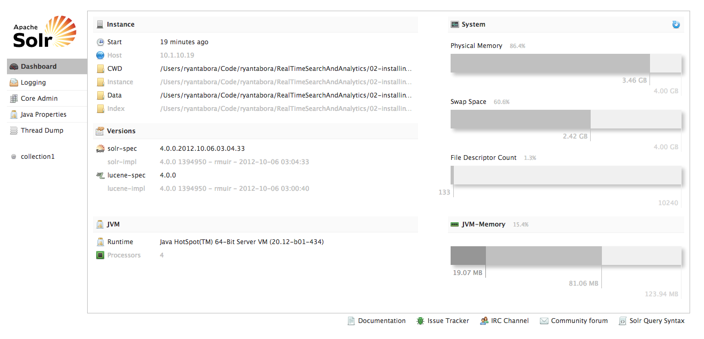
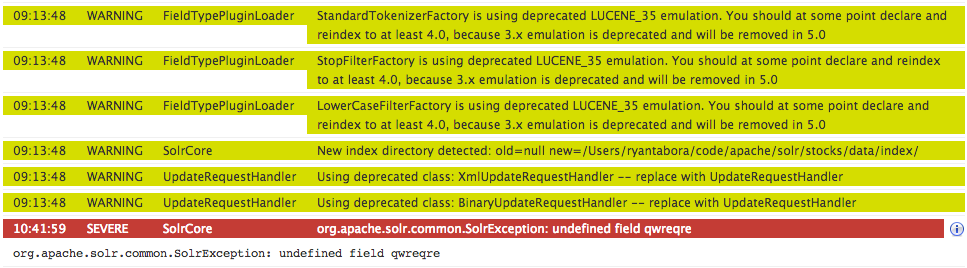
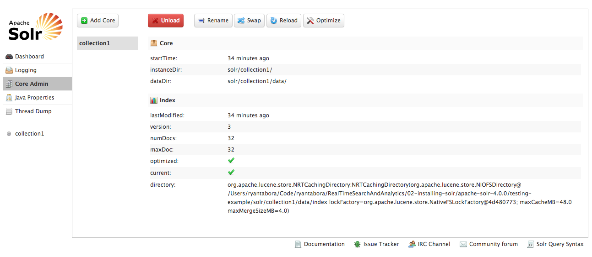
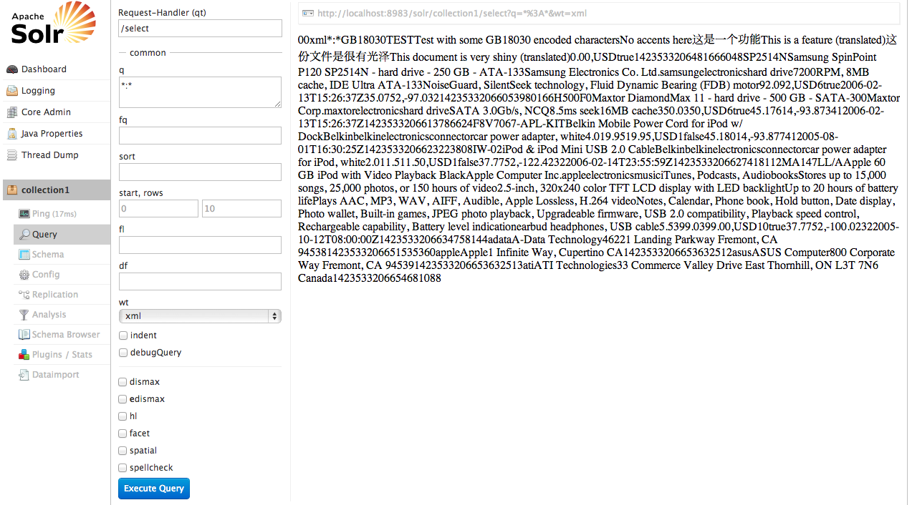
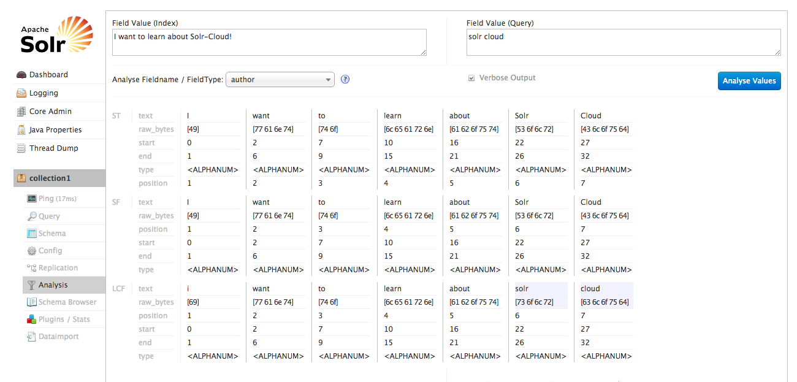

Real Time Search and Analytics on Big Data - Solr UI
=============

Introduction
-------
This exercise will guide you through the Solr UI. Feel free to click around and explore on your own too!

Prerequisites
-------
* Solr should be installed and running.

Browsing the Solr UI
-------

### Navigate to the Solr Dashboard.

You can find the Solr UI at http://localhost:8983/solr/#/. Open a browser and go to that URL. By default, the dashboard is the first page that you will see.

Here you can learn a bit about your Solr installation at a high level, such as which version you're running and how much memory you are using.

### Logging Section

Navigate to the logging section of the UI. Here, the Solr UI displays the Solr logs with color coding to help the user easily identify issues.

By default, the logging UI displays WARNING messages and higher. If a SEVERE log message is triggered, the user can click an information button to learn more about the error. For example, this one was triggered when a incorrect field was submitted to Solr.

### Core Admin Section

Head to the Core Admin section of the UI. Here, you can do some interesting things like adding (if you have the configuration files preset), unloading (will not delete the index, just 'shut it down'), swapping, and renaming cores. You can also view some of the details about the cores themselves. Check how many documents you have indexed!

### Details Section

We're going to skip the Java Properties and Thread Dump sections as they are pretty self explanitory. The details section will display some information about each collection/core in your Solr installation (per core for standard Solr install, per collection for Solr Cloud). Click collection1 for more details. There are some details about this collection as well as some added functionality on the navigation bar on the left hand side of the UI. Some of the notable sections include:

* Ping: Check to see if the core is running.
* Query: Run queries through an easy to use query builder.
* Schema: View the schema.xml
* Config: View the solrconfig.xml
* Analysis: A very helpful analysis tool for debugging queries and indexed data.

#### Query Tool

Click on the query tab and look at the query builder tool you can use to submit queries against your index. By default it creates a select all query (\*:\*). Click execute query and view the results!

#### Analysis Tool

Now let's try the Analysis tab. You get two fields, one for the source data that is indexed and another for the query. This way you can play around with how queries will worked against different sets of indexed data.

Try entering 'I want to learn about Solr-Cloud!' as the Field Value (Indexed), setting the Fieldname/Fieldtype to author, and entering solr cloud for the Field Value (Query). After clicking Analyse Values you will see the results as they are put through the different analyzers specified in the schema.xml. The Solr UI will automatically highlight any matches if available (here solr and cloud).

Additional Resources
-------

Feel free to explore the UI, most of it is very intuitive. The wiki is somewhat limited, but you can find it here if you would like to learn more:

* http://wiki.apache.org/solr/SolrAdminGUI