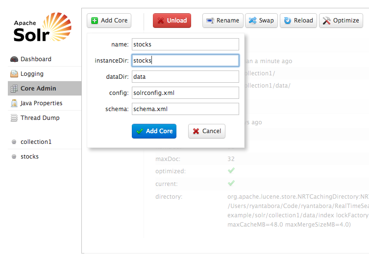

Real Time Search and Analytics on Big Data - Solr Indexing via SolrJ
=============

Introduction
-------
This exercise will guide you through indexing documents via the native Java API.

Prerequisites
-------
* Already downloaded and installed Solr
* Familiar with Solr Admin GUI

Creating the Stocks Core
-------

### Create the Configuration Files

Prior to this exercise you should have already installed and got Solr running. If you haven't make sure to go back to the installing-solr exercise and finish that first.

Your Solr install should be located in a file path somewhat similar to the following:

	$ pwd
	/RealTimeSearchAndAnalytics/03-installing-solr/apache-solr-4.0.0/testing-example/solr

 You might have named the 'testing-example' directory something different, but if you recall it is simply a copy of the /apache-solr-4.0.0/example directory. Inside of this directory, you should have the following files:
	
	$ ls
	README.txt	bin		collection1	solr.xml	zoo.cfg

Now create a new folder called 'stocks'.

	$ mkdir stocks

Copy over the configuration files that have been provided.

	$ cp -r /RealTimeSearchAndAnalytics/05-solr-index/stocks/* /RealTimeSearchAndAnalytics/03-installing-solr/apache-solr-4.0.0/testing-example/solr/stocks/
	$ cd stocks
	$ ls -R
	conf	data

	./conf:
	admin-extra.html		currency.xml			mapping-FoldToASCII.txt		schema.xml			spellings.txt			update-script.js
	admin-extra.menu-bottom.html	elevate.xml			mapping-ISOLatin1Accent.txt	scripts.conf			stopwords.txt			velocity
	admin-extra.menu-top.html	lang				protwords.txt			solrconfig.xml			synonyms.txt			xslt

	./conf/lang:
	contractions_ca.txt	stemdict_nl.txt		stopwords_cz.txt	stopwords_es.txt	stopwords_ga.txt	stopwords_id.txt	stopwords_no.txt	stopwords_th.txt
	contractions_fr.txt	stoptags_ja.txt		stopwords_da.txt	stopwords_eu.txt	stopwords_gl.txt	stopwords_it.txt	stopwords_pt.txt	stopwords_tr.txt
	contractions_ga.txt	stopwords_ar.txt	stopwords_de.txt	stopwords_fa.txt	stopwords_hi.txt	stopwords_ja.txt	stopwords_ro.txt	userdict_ja.txt
	contractions_it.txt	stopwords_bg.txt	stopwords_el.txt	stopwords_fi.txt	stopwords_hu.txt	stopwords_lv.txt	stopwords_ru.txt
	hyphenations_ga.txt	stopwords_ca.txt	stopwords_en.txt	stopwords_fr.txt	stopwords_hy.txt	stopwords_nl.txt	stopwords_sv.txt

	./conf/velocity:
	VM_global_library.vm	clusterResults.vm	facet_pivot.vm		facets.vm		header.vm		join-doc.vm		layout.vm		query.vm		richtext-doc.vm
	browse.vm		debug.vm		facet_queries.vm	footer.vm		hit.vm			jquery.autocomplete.css	main.css		queryGroup.vm		suggest.vm
	cluster.vm		facet_fields.vm		facet_ranges.vm		head.vm			hitGrouped.vm		jquery.autocomplete.js	product-doc.vm		querySpatial.vm		tabs.vm

	./conf/xslt:
	example.xsl		example_atom.xsl	example_rss.xsl		luke.xsl		updateXml.xsl

	./data:

Take a look at the schema.xml file.

	$ cat ./conf/schema.xml 

### Add the Core To Solr

Now we need to get Solr to recognize the new core. Navigate to the Solr Admin GUI.

[http://localhost:8983/solr/](http://localhost:8983/solr/)

Click on the Core Admin and select Add Core. Fill in the provided dialog box.

	name:stocks
	instanceDir:stocks
	dataDir:data
	config:solrconfig.xml
	schema:schema.xml

Select Add Core. Now refresh the page and you should see that Solr recognizes the new core. You can also view the log file from the terminal that is running the Solr process (the terminal you used to execute java -jar start.jar) to verify that it has recognized the new core.

	Jan 18, 2013 9:24:14 AM org.apache.solr.core.CoreContainer register
	INFO: registering core: stocks
	Jan 18, 2013 9:24:14 AM org.apache.solr.core.CoreContainer persistFile
	INFO: Persisting cores config to solr/solr.xml
	Jan 18, 2013 9:24:14 AM org.apache.solr.core.SolrXMLSerializer persistFile
	INFO: Persisting cores config to solr/solr.xml
	Jan 18, 2013 9:24:22 AM org.apache.solr.core.SolrCore execute
	INFO: [collection1] webapp=/solr path=/admin/system params={wt=json} status=0 QTime=32 
	Jan 18, 2013 9:24:23 AM org.apache.solr.core.SolrCore execute
	INFO: [stocks] webapp=/solr path=/admin/file/ params={file=admin-extra.menu-top.html} status=0 QTime=2 
	Jan 18, 2013 9:24:23 AM org.apache.solr.core.SolrCore execute
	INFO: [stocks] webapp=/solr path=/admin/luke params={numTerms=0&wt=json&show=index} status=0 QTime=8 
	Jan 18, 2013 9:24:23 AM org.apache.solr.core.SolrCore execute
	INFO: [stocks] webapp=/solr path=/admin/file/ params={file=admin-extra.html} status=0 QTime=0 
	Jan 18, 2013 9:24:23 AM org.apache.solr.core.SolrCore execute
	INFO: [stocks] webapp=/solr path=/admin/ping params={action=status&wt=json} status=503 QTime=3 
	Jan 18, 2013 9:24:23 AM org.apache.solr.core.SolrCore execute
	INFO: [stocks] webapp=/solr path=/admin/file/ params={file=admin-extra.menu-bottom.html} status=0 QTime=0 

Understanding the Data Model
-------

### Look at the Data

Included in this download is a sample set of freely available stock exchange data downloaded from Infochimps.

* [Infochimps AMEX Stock Data](http://www.infochimps.com/datasets/amex-exchange-daily-1970-2010-open-close-high-low-and-volume)
* [Infochimps NYSE Stock Data](http://www.infochimps.com/datasets/nyse-daily-1970-2010-open-close-high-low-and-volume)
* [Infochimps NASDAQ Stock Data](http://www.infochimps.com/datasets/nasdaq-exchange-daily-1970-2010-open-close-high-low-and-volume)

Lets take a look at some of the data included. Locate the data directory.

	$ cd /RealTimeSearchAndAnalytics/data/
	$ ls
	infochimps_dataset_AMEX_Daily_1970-2010-csv.zip		infochimps_dataset_NASDAQ_Daily_1970-2010-csv.zip	infochimps_dataset_NYSE_Daily_1970-2010-csv.zip		tinydata

Unzip the NYSE dataset and look at some of the data.

	$ unzip infochimps_dataset_NYSE_Daily_1970-2010-csv.zip 
	Archive:  infochimps_dataset_NYSE_Daily_1970-2010-csv.zip
	  inflating: infochimps_dataset_4778_download_16677/README-infochimps  
	  inflating: infochimps_dataset_4778_download_16677/infochimps_dataset_4778_download_16677.icss.yaml  
	   creating: infochimps_dataset_4778_download_16677/NYSE/
	  inflating: infochimps_dataset_4778_download_16677/NYSE/NYSE_daily_prices_I.csv  
	  inflating: infochimps_dataset_4778_download_16677/NYSE/NYSE_daily_prices_2.csv  
	  inflating: infochimps_dataset_4778_download_16677/NYSE/NYSE_daily_prices_L.csv  
	 extracting: infochimps_dataset_4778_download_16677/NYSE/NYSE_dividends_4.csv  
	  inflating: infochimps_dataset_4778_download_16677/NYSE/NYSE_dividends_D.csv  
	  .
	  .
	  .
	$ cd infochimps_dataset_4778_download_16677/NYSE/
	$ ls 
	NYSE_daily_prices_0.csv	NYSE_daily_prices_8.csv	NYSE_daily_prices_G.csv	NYSE_daily_prices_O.csv	NYSE_daily_prices_W.csv	NYSE_dividends_4.csv	NYSE_dividends_C.csv	NYSE_dividends_K.csv	NYSE_dividends_S.csv
	NYSE_daily_prices_1.csv	NYSE_daily_prices_9.csv	NYSE_daily_prices_H.csv	NYSE_daily_prices_P.csv	NYSE_daily_prices_X.csv	NYSE_dividends_5.csv	NYSE_dividends_D.csv	NYSE_dividends_L.csv	NYSE_dividends_T.csv
	NYSE_daily_prices_2.csv	NYSE_daily_prices_A.csv	NYSE_daily_prices_I.csv	NYSE_daily_prices_Q.csv	NYSE_daily_prices_Y.csv	NYSE_dividends_6.csv	NYSE_dividends_E.csv	NYSE_dividends_M.csv	NYSE_dividends_U.csv
	NYSE_daily_prices_3.csv	NYSE_daily_prices_B.csv	NYSE_daily_prices_J.csv	NYSE_daily_prices_R.csv	NYSE_daily_prices_Z.csv	NYSE_dividends_7.csv	NYSE_dividends_F.csv	NYSE_dividends_N.csv	NYSE_dividends_V.csv
	NYSE_daily_prices_4.csv	NYSE_daily_prices_C.csv	NYSE_daily_prices_K.csv	NYSE_daily_prices_S.csv	NYSE_dividends_0.csv	NYSE_dividends_8.csv	NYSE_dividends_G.csv	NYSE_dividends_O.csv	NYSE_dividends_W.csv
	NYSE_daily_prices_5.csv	NYSE_daily_prices_D.csv	NYSE_daily_prices_L.csv	NYSE_daily_prices_T.csv	NYSE_dividends_1.csv	NYSE_dividends_9.csv	NYSE_dividends_H.csv	NYSE_dividends_P.csv	NYSE_dividends_X.csv
	NYSE_daily_prices_6.csv	NYSE_daily_prices_E.csv	NYSE_daily_prices_M.csv	NYSE_daily_prices_U.csv	NYSE_dividends_2.csv	NYSE_dividends_A.csv	NYSE_dividends_I.csv	NYSE_dividends_Q.csv	NYSE_dividends_Y.csv
	NYSE_daily_prices_7.csv	NYSE_daily_prices_F.csv	NYSE_daily_prices_N.csv	NYSE_daily_prices_V.csv	NYSE_dividends_3.csv	NYSE_dividends_B.csv	NYSE_dividends_J.csv	NYSE_dividends_R.csv	NYSE_dividends_Z.csv

As you can see we have two types of files, dividends and daily prices. Take a look at what these files look like.

	$ head NYSE_daily_prices_A.csv 
	exchange,stock_symbol,date,stock_price_open,stock_price_high,stock_price_low,stock_price_close,stock_volume,stock_price_adj_close
	NYSE,AEA,2010-02-08,4.42,4.42,4.21,4.24,205500,4.24
	NYSE,AEA,2010-02-05,4.42,4.54,4.22,4.41,194300,4.41
	NYSE,AEA,2010-02-04,4.55,4.69,4.39,4.42,233800,4.42
	NYSE,AEA,2010-02-03,4.65,4.69,4.50,4.55,182100,4.55
	NYSE,AEA,2010-02-02,4.74,5.00,4.62,4.66,222700,4.66
	NYSE,AEA,2010-02-01,4.84,4.92,4.68,4.75,194800,4.75
	NYSE,AEA,2010-01-29,4.97,5.05,4.76,4.83,222900,4.83
	NYSE,AEA,2010-01-28,5.12,5.22,4.81,4.98,283100,4.98
	NYSE,AEA,2010-01-27,4.82,5.16,4.79,5.09,243500,5.09
	$ head NYSE_dividends_A.csv 
	exchange,stock_symbol,date,dividends
	NYSE,AIT,2009-11-12,0.15
	NYSE,AIT,2009-08-12,0.15
	NYSE,AIT,2009-05-13,0.15
	NYSE,AIT,2009-02-11,0.15
	NYSE,AIT,2008-11-12,0.15
	NYSE,AIT,2008-08-13,0.15
	NYSE,AIT,2008-05-13,0.15
	NYSE,AIT,2008-02-13,0.15
	NYSE,AIT,2007-11-13,0.15

I've created another folder called tinydata which contains some of the smaller files so we can run our examples quickly. 

### Examine the Stocks schema.xml

	$ cat ./03-installing-solr/apache-solr-4.0.0/testing-example/solr/stocks/conf/schema.xml 
	<?xml version="1.0" encoding="UTF-8" ?>
	<schema name="stocks" version="1.5">
	 <types>
	  <fieldType name="string" class="solr.StrField"/>
	  <fieldType name="long" class="solr.LongField"/>
	  <fieldType name="float" class="solr.SortableFloatField"/>  
	  <fieldType name="date" class="solr.DateField"/>
	  <fieldType name="text_general" class="solr.TextField" positionIncrementGap="100">
	    <analyzer type="index">
	      <tokenizer class="solr.StandardTokenizerFactory"/>
	      <filter class="solr.StopFilterFactory" ignoreCase="true" words="stopwords.txt" enablePositionIncrements="true" />
	      <filter class="solr.LowerCaseFilterFactory"/>
	    </analyzer>
	    <analyzer type="query">
	      <tokenizer class="solr.StandardTokenizerFactory"/>
	      <filter class="solr.StopFilterFactory" ignoreCase="true" words="stopwords.txt" enablePositionIncrements="true" />
	      <filter class="solr.SynonymFilterFactory" synonyms="synonyms.txt" ignoreCase="true" expand="true"/>
	      <filter class="solr.LowerCaseFilterFactory"/>
	    </analyzer>
	  </fieldType>
	</types>
	<fields>

	  <field name="rowkey"  type="string" indexed="true"  stored="true"/>
	  <field name="exchange"  type="string" indexed="true"  stored="true"/>
	  <field name="stock_symbol"  type="string" indexed="true"  stored="true"/>
	  <field name="date"  type="date" indexed="true"  stored="true"/>
	  <field name="stock_price_open"  type="float" indexed="true"  stored="true"/>
	  <field name="stock_price_high"  type="float" indexed="true"  stored="true"/>
	  <field name="stock_price_low"  type="float" indexed="true"  stored="true"/>
	  <field name="stock_price_close"  type="float" indexed="true"  stored="true"/>
	  <field name="stock_volume"  type="float" indexed="true"  stored="true"/>
	  <field name="stock_price_adj_close"  type="float" indexed="true"  stored="true"/>
	  <field name="dividends"  type="float" indexed="true"  stored="true"/>
	  <field name="_version_" type="long" indexed="true" stored="true"/>
	  
	  <field name="all" type="text_general" indexed="true" stored="false" multiValued="true"/>
	  
	  <copyField source="rowkey" dest="all" />
	  <copyField source="exchange" dest="all" />
	  <copyField source="stock_symbol" dest="all" />
	  <copyField source="date" dest="all" />
	  <copyField source="stock_price_open" dest="all" />
	  <copyField source="stock_price_high" dest="all" />
	  <copyField source="stock_price_low" dest="all" />
	  <copyField source="stock_price_close" dest="all" />
	  <copyField source="stock_volume" dest="all" />
	  <copyField source="stock_price_adj_close" dest="all" />
	  <copyField source="dividends" dest="all" />

	</fields>

	<defaultSearchField>all</defaultSearchField>
	<uniqueKey>rowkey</uniqueKey>

	</schema>

Running the Exercise
-------

### Run the Stocks Indexer

The jar is already provided in the directory for this exercise, however if you want to build the jar yourself you can use the following Maven command.

	$ cd ~/code/ryantabora/RealTimeSearchAndAnalytics/05-solr-index/
	.classpath                  .project                    .settings/                  README.md                   dependency-reduced-pom.xml  pom.xml                     src/                        target/

	$ mvn clean package
	[INFO] Scanning for projects...
	[INFO]                                                                         
	[INFO] ------------------------------------------------------------------------
	[INFO] Building solr-index 1.0-SNAPSHOT
	[INFO] ------------------------------------------------------------------------
	[INFO] 
	[INFO] --- maven-clean-plugin:2.4.1:clean (default-clean) @ solr-index ---
	[INFO] Deleting /Users/ryantabora/Code/ryantabora/RealTimeSearchAndAnalytics/05-solr-index/target
	[INFO] 
	[INFO] --- maven-resources-plugin:2.5:resources (default-resources) @ solr-index ---
	[debug] execute contextualize
	[INFO] Using 'UTF-8' encoding to copy filtered resources.
	[INFO] skip non existing resourceDirectory /Users/ryantabora/Code/ryantabora/RealTimeSearchAndAnalytics/05-solr-index/src/main/resources
	[INFO] 
	[INFO] --- maven-compiler-plugin:2.3.2:compile (default-compile) @ solr-index ---
	[INFO] Compiling 1 source file to /Users/ryantabora/Code/ryantabora/RealTimeSearchAndAnalytics/05-solr-index/target/classes
	[INFO] 
	[INFO] --- maven-resources-plugin:2.5:testResources (default-testResources) @ solr-index ---
	[debug] execute contextualize
	[INFO] Using 'UTF-8' encoding to copy filtered resources.
	[INFO] skip non existing resourceDirectory /Users/ryantabora/Code/ryantabora/RealTimeSearchAndAnalytics/05-solr-index/src/test/resources
	[INFO] 
	[INFO] --- maven-compiler-plugin:2.3.2:testCompile (default-testCompile) @ solr-index ---
	[INFO] Compiling 2 source files to /Users/ryantabora/Code/ryantabora/RealTimeSearchAndAnalytics/05-solr-index/target/test-classes
	[INFO] 
	[INFO] --- maven-surefire-plugin:2.10:test (default-test) @ solr-index ---
	[INFO] Surefire report directory: /Users/ryantabora/Code/ryantabora/RealTimeSearchAndAnalytics/05-solr-index/target/surefire-reports

	-------------------------------------------------------
	 T E S T S
	-------------------------------------------------------

	Results :

	Tests run: 0, Failures: 0, Errors: 0, Skipped: 0

	[INFO] 
	[INFO] --- maven-jar-plugin:2.3.2:jar (default-jar) @ solr-index ---
	[INFO] Building jar: /Users/ryantabora/Code/ryantabora/RealTimeSearchAndAnalytics/05-solr-index/target/solr-index-1.0-SNAPSHOT.jar
	[INFO] 
	[INFO] --- maven-shade-plugin:2.0:shade (default) @ solr-index ---
	[INFO] Including org.apache.solr:solr-solrj:jar:4.0.0-BETA in the shaded jar.
	[INFO] Including org.apache.zookeeper:zookeeper:jar:3.3.6 in the shaded jar.
	[INFO] Including org.apache.httpcomponents:httpmime:jar:4.1.3 in the shaded jar.
	[INFO] Including org.apache.httpcomponents:httpcore:jar:4.1.4 in the shaded jar.
	[INFO] Including commons-logging:commons-logging:jar:1.1.1 in the shaded jar.
	[INFO] Including commons-io:commons-io:jar:2.1 in the shaded jar.
	[INFO] Including org.apache.httpcomponents:httpclient:jar:4.1.3 in the shaded jar.
	[INFO] Including commons-codec:commons-codec:jar:1.4 in the shaded jar.
	[INFO] Including org.codehaus.woodstox:wstx-asl:jar:3.2.7 in the shaded jar.
	[INFO] Including org.slf4j:slf4j-api:jar:1.6.4 in the shaded jar.
	[INFO] Including junit:junit:jar:4.8.1 in the shaded jar.
	[INFO] Replacing original artifact with shaded artifact.
	[INFO] Replacing /Users/ryantabora/Code/ryantabora/RealTimeSearchAndAnalytics/05-solr-index/target/solr-index-1.0-SNAPSHOT.jar with /Users/ryantabora/Code/ryantabora/RealTimeSearchAndAnalytics/05-solr-index/target/solr-index-1.0-SNAPSHOT-shaded.jar
	[INFO] Dependency-reduced POM written at: /Users/ryantabora/Code/ryantabora/RealTimeSearchAndAnalytics/05-solr-index/dependency-reduced-pom.xml
	[INFO] ------------------------------------------------------------------------
	[INFO] BUILD SUCCESS
	[INFO] ------------------------------------------------------------------------
	[INFO] Total time: 5.404s
	[INFO] Finished at: Fri Jan 18 10:11:35 PST 2013
	[INFO] Final Memory: 11M/81M
	[INFO] ------------------------------------------------------------------------

Now you can run the jar by providing it with the data location and Solr server URL.

	$ java -jar ./solr-index-1.0-SNAPSHOT.jar --data ../data/tinydata/ --solr http://localhost:8983/solr/stocks
	args: [--data, ../data/tinydata/, --solr, http://localhost:8983/solr/stocks]
	SLF4J: Failed to load class "org.slf4j.impl.StaticLoggerBinder".
	SLF4J: Defaulting to no-operation (NOP) logger implementation
	SLF4J: See http://www.slf4j.org/codes.html#StaticLoggerBinder for further details.
	Successfully put rowkey : QTM|2010-02-08 to Solr
	Successfully put rowkey : QTM|2010-02-05 to Solr
	Successfully put rowkey : QTM|2010-02-04 to Solr
	Successfully put rowkey : QTM|2010-02-03 to Solr
	.
	.
	.
	Successfully put rowkey : OPY|1996-08-07 to Solr
	Successfully put rowkey : OPY|1996-05-07 to Solr
	Successfully put rowkey : OPY|1996-02-07 to Solr
	Successfully put rowkey : OPY|1995-02-07 to Solr
	Indexed 5983 documents

As the jar is running, you can watch the index count increase via the Solr Web REST Interface.

[http://localhost:8983/solr/stocks/select?q=\*:\*](http://localhost:8983/solr/stocks/select?q=*:*)

### Examine the Code

You can find the code for the StocksIndexer at RealTimeSearchAndAnalytics/05-solr-index/src/main/java/com/ryantabora/tutorial/StocksIndexer.java. Take a look at the code and review the comments to help you understand how we indexed all that stock data!

### Creating Your Own Code

In the test folder you will find two files, Exercise.java and Solution.java. The Exercise contains a skeleton class you can use to populate your own index based on some simple CSV data provided in the class. You will need to create another core (I called mine mycore) and write your own code. If you get stuck, take a look at the provided configuration files in the solution directory and the Solution.java code.